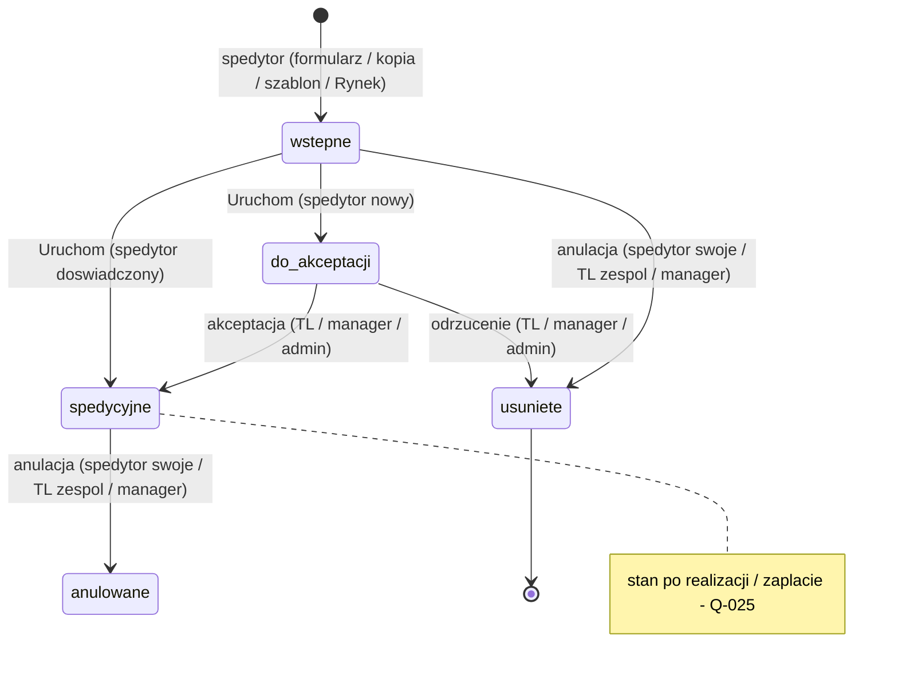
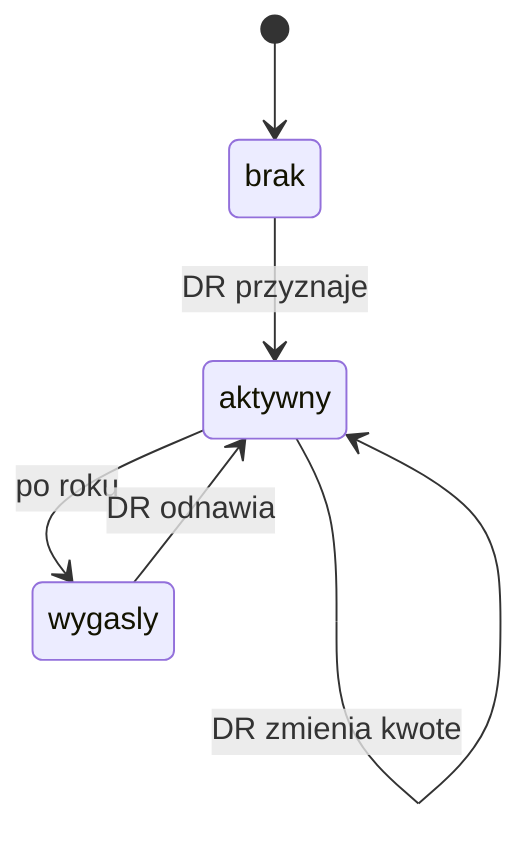
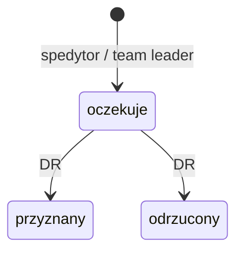
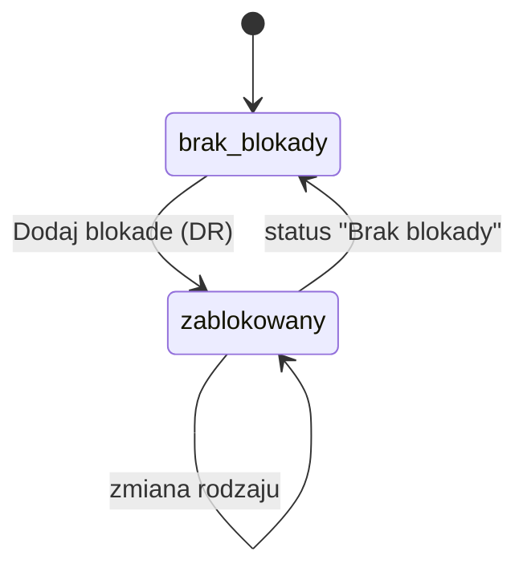
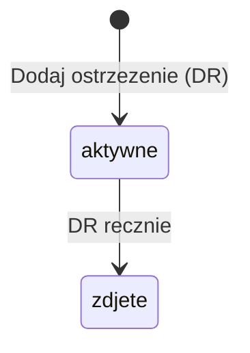
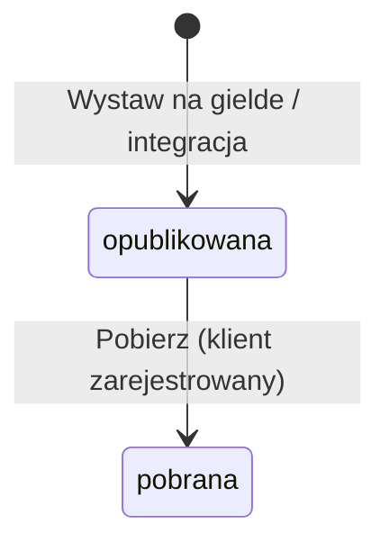
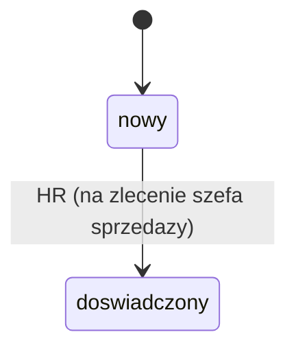

# Encje i stany

Dla kazdej encji: pola kluczowe, stany, przejscia (kto moze), diagram Mermaid.
`Zakwestionowane:` wypelniasz tylko wtedy, gdy zrodlo wyzsze w hierarchii podmylo
strukture encji - wpisz stany/przejscia i numer pytania. Puste = brak zastrzezen.

## Zlecenie
Pola: numer tymczasowy (00000/_/rr), numer docelowy (000000/mm/rr), etap (order_stage), data utworzenia (= dzien uruchomienia),
pochodzenie (formularz / kopia / szablon / Rynek);
Klient: klient, oddzial, przebitka (spolka z grupy), zrodlo klienta, zgoda na platnosc na skanach, dokumenty przez portal;
Przewoznik: przewoznik, oddzial, przebitka (spolka z grupy);
spolka limitu (wskazana przez spedytora z puli, D-007);
Trasa: plik zlecenia (PDF/JPG/PNG), typy pojazdu (Firanka, Chlodnia, Cysterna, Platforma, Kontener, Mega, Inny), laczna waga (wyliczana), numery rejestracyjne,
miejsca zaladunku i rozladunku (lista) z pozycjami ladunku, dlugosc trasy (deklarowana i wyliczana), wymagania specjalne, uwagi ogolne;
Fracht: fracht klienta + waluta, fracht przewoznika + waluta, termin platnosci (z kartoteki, "Odblokuj edycje"), podzial marzy (opcja; lista: spedytor pomagajacy + kwota, wpisuje spedytor prowadzacy - D-031), kary umowne, koszty anulacji, koszty postojowe;
zalaczniki; kontakty (domyslnie rola "Kierowca").
Zrodlo: [Dok] prototyp-proces-dodawania-zlecenia.md §1-3; [Biz] session-2026-09-26.md (D-001, D-007..D-009, D-011..D-013, D-019).

Stany:
- `wstepne` - draft, numer tymczasowy; mozna zapisywac wielokrotnie; "Zapisz wstepnie" zapisuje ten sam rekord (D-025)
- `do_akceptacji` - uruchomione przez spedytora klasy "nowy"
- `spedycyjne` - zawarte, w realizacji
- `anulowane` - zaakceptowane i anulowane; zostaje w systemie do rozliczenia kosztow
- (usuniete trwale) - odrzucone przez TL albo anulowane jako wstepne; rekord znika bez sladu (D-008, D-009)
- stan po wykonaniu transportu / zaplacie - brak w zrodlach, Q-025

Przejscia:
| Z | Do | Kto | Warunek / skutek | Zrodlo |
|---|----|-----|------------------|--------|
| [*] | wstepne | spedytor | formularz, kopia (D-035), szablon (D-026) albo "Pobierz" z Rynku (klient musi byc zarejestrowany) | [Dok] prototyp-proces-dodawania-zlecenia.md §2 pkt 1, §3; [Biz] session-2026-09-26.md, Q-015 (D-014) |
| wstepne | do_akceptacji | spedytor klasy "nowy" | "Uruchom": numer docelowy, data utworzenia | [Dok] prototyp-proces-dodawania-zlecenia.md §2 pkt 2; [Biz] session-2026-09-26.md, Q-001 (D-001) |
| wstepne | spedycyjne | spedytor klasy "doswiadczony" | "Uruchom": numer docelowy, data utworzenia | [Dok] prototyp-proces-dodawania-zlecenia.md §2 pkt 2 |
| do_akceptacji | spedycyjne | team leader / manager / admin | akceptacja | [Dok] prototyp-proces-dodawania-zlecenia.md §2 pkt 2-3; [Biz] session-2026-09-26.md, Q-001 (D-001) |
| do_akceptacji | (usuniete trwale) | team leader / manager / admin | odrzucenie, bez sladu | [Biz] session-2026-09-26.md, Q-008 (D-008); [Biz] session-2026-09-27.md, Q-028 (D-023) |
| wstepne | (usuniete trwale) | spedytor (swoje) / team leader (swoj zespol) / manager (swoje zespoly) - D-033 | anulacja bez kosztow | [Biz] session-2026-09-26.md, Q-009, Q-026 (D-009, D-021) |
| spedycyjne | anulowane | spedytor (swoje) / team leader (swoj zespol) / manager (swoje zespoly) - D-033 | rozliczenie, koszty ponosi strona winna | [Biz] session-2026-09-26.md, Q-009, Q-023, Q-026 (D-009, D-019, D-021) |
| spedycyjne | ? | brak - Q-025 | wykonanie transportu, zaplata | - |

Zawarcie = wejscie w `spedycyjne` (D-020). Straznicy (sprawdzane przy wyborze kontrahenta, D-006, i przy zawarciu): brak blokady w zakresie spolki lub calosci (BR-007),
limit spolki limitu dla klienta (BR-006), fracht klienta <= wolne saldo (BR-008).
Zakwestionowane:

## Kontrahent (Klient / Przewoznik)
Pola: typ (klient / przewoznik), nazwa, NIP, oddzialy, grupa kapitalowa, termin platnosci domyslny, status blokady (kolumna na liscie, klik = historia),
historia blokad, ostrzezenia, historia zmian (event log), weryfikacja KYC / status weryfikacji (Q-037);
tylko klient: NUU, limity per spolka, kolumna "Dostepny limit" (D-002);
tylko przewoznik: zakladka "Ubezpieczenia i licencje" (polisy OCP/OCS, licencja przewozowa).
Stany: brak cyklu zycia w zrodlach; warunek biznesowy - klient musi byc zarejestrowany przed zleceniem (D-014).
Status ryzyka (wyliczany, per kontekst spolki): czerwony / zolty / zielony - BR-019.
Zrodlo: [Dok] wymagania-limity-i-blokady.md §1, §3-7; [Dok] prototyp-proces-dodawania-zlecenia.md §1; [Biz] session-2026-09-26.md (D-002, D-014, D-016).
Zakwestionowane:

## Limit kredytowy (klient x spolka z grupy)
Pola: klient, spolka z grupy, kwota (PLN), wykorzystano, wolne saldo, data przyznania, data waznosci (+1 rok), znacznik "wniosek oczekuje".
Stany:
- `brak` - spolka nie ma limitu dla klienta = blokada z braku limitu (czerwony w kontekscie tej spolki)
- `aktywny` - przyznany, wazny
- `wygasly` - minal rok
Przejscia:
| Z | Do | Kto | Warunek | Zrodlo |
|---|----|-----|---------|--------|
| brak | aktywny | DR | przyznanie po wniosku albo edycja w panelu admina | [Biz] session-2026-09-26.md, Q-005 (D-005); [Dok] wymagania-limity-i-blokady.md §2, §7 |
| aktywny | aktywny | DR | zmiana kwoty (zwiekszenie po wniosku, edycja globalna) | [Dok] wymagania-limity-i-blokady.md §2, §7; [Biz] session-2026-09-26.md (D-005) |
| aktywny | wygasly | system (po roku) | rok od przyznania | [Biz] session-2026-09-26.md, Q-016 (D-015) |
| wygasly | aktywny | DR | odnowienie po wniosku "Odnow" | [Biz] session-2026-09-26.md, Q-016 (D-015); [Biz] session-2026-09-27.md, Q-032 (D-028) |
Saldo: zawarcie zlecenia -> wykorzystano += fracht klienta w PLN (sredni kurs NBP z dnia roboczego przed zawarciem); zaplata -> wykorzystano -= fracht (BR-009..BR-011).
Zakwestionowane:

## Wniosek o limit
Pola: klient, spolka z grupy, rodzaj (nadanie / zwiekszenie / odnowienie - D-028), wnioskujacy, data, decyzja, kwota przyznana (wpisuje DR).
Stany: `oczekuje` (u DR w zakladce "Operacje" > "Limity" z licznikiem oczekujacych; przy spolce status "oczekuje"), `przyznany`, `odrzucony`.
Przejscia:
| Z | Do | Kto | Skutek | Zrodlo |
|---|----|-----|--------|--------|
| [*] | oczekuje | spedytor albo team leader | - | [Biz] session-2026-09-26.md, Q-004, Q-005 (D-004, D-005) |
| oczekuje | przyznany | DR | limit i kwota w kartotece, znika "wniosek oczekuje" | [Dok] wymagania-limity-i-blokady.md §2; [Biz] session-2026-09-26.md (D-005, D-017) |
| oczekuje | odrzucony | DR | spedytor nie moze zawrzec zlecenia - odmowa realizacji | [Biz] session-2026-09-26.md, Q-011 (D-011) |
Zakwestionowane:

## Blokada
Pola: kontrahent, zakres (spolka z grupy albo caly kontrahent - D-016), status (Brak blokady / Blokada platnosci / Blokada wspolpracy / Blokada dokumentow / Pelna blokada),
powod/opis (wymagany), kto, kiedy. Wpisy tworza historie blokad; aktualny status = ostatni wpis w danym zakresie.
Stany: `brak_blokady` (domyslnie, zielony tag), `zablokowany` (jeden z 4 rodzajow).
Przejscia:
| Z | Do | Kto | Zrodlo |
|---|----|-----|--------|
| brak_blokady | zablokowany | DR | [Dok] wymagania-limity-i-blokady.md §4; [Biz] session-2026-09-27.md, Q-027 (D-022) |
| zablokowany | zablokowany (inny rodzaj) | DR | [Dok] wymagania-limity-i-blokady.md §4; [Biz] session-2026-09-27.md, Q-027 (D-022) |
| zablokowany | brak_blokady | DR | [Dok] wymagania-limity-i-blokady.md §4; [Biz] session-2026-09-27.md, Q-027 (D-022) |
Zakwestionowane:

## Ostrzezenie
Pola: kontrahent, typ (Limit przeterminowany / Opoznienie platnosci / Dokumenty wygasajace / Reklamacja / Ryzyko wspolpracy / Inne ostrzezenie), powod/opis (wymagany),
zakres (spolka z grupy albo caly kontrahent - D-024).
Stany: `aktywne`, `zdjete`.
Przejscia:
| Z | Do | Kto | Zrodlo |
|---|----|-----|--------|
| [*] | aktywne | DR | [Dok] wymagania-limity-i-blokady.md §5 |
| aktywne | zdjete | DR, recznie (zasady wygasania - Q-014, zaparkowane) | [Biz] session-2026-09-26.md, Q-014 |
Zakwestionowane:

## Oferta (Rynek)
Pola: rodzaj (towar / wolny pojazd), pochodzenie (wlasna, reczna, Gielda A, Gielda B), zlecenie zrodlowe (przy "Wystaw na gielde").
Stany: `opublikowana`, `pobrana` (stala sie zleceniem wstepnym).
Przejscia:
| Z | Do | Kto | Warunek | Zrodlo |
|---|----|-----|---------|--------|
| [*] | opublikowana | "Wystaw na gielde" z listy zlecen wstepnych/spedycyjnych; rola? Q-038; albo integracja Gielda A/Gielda B | - | [Dok] prototyp-proces-dodawania-zlecenia.md §2 pkt 5 |
| opublikowana | pobrana | rola? Q-038 | klient zarejestrowany (D-014) | [Dok] prototyp-proces-dodawania-zlecenia.md §2 pkt 5; [Biz] session-2026-09-26.md, Q-015 |
Zakwestionowane:

## Szablon zlecenia
Pola: nazwa, dane zlecenia do powtorzenia (zakres pol - brak w zrodlach), autor (spedytor), widocznosc: tylko autor (D-027).
Stany: brak cyklu zycia w zrodlach - zapisany na stale, uzywany wielokrotnie; uzycie tworzy zlecenie wstepne.
Zrodlo: [Dok] prototyp-proces-dodawania-zlecenia.md §3; [Biz] session-2026-09-27.md, Q-031, Q-060 (D-026, D-027).
Zakwestionowane:

## Konto spedytora
Pola: pracodawca (spolka z grupy), klasa (nowy / doswiadczony), pula spolek (konfiguracja), rola (spedytor / team_leader / manager / admin),
zespol i przelozony (spedytor -> team leader -> manager; D-033; kto wpisuje - Q-066).
Stany klasy: `nowy` -> `doswiadczony` (HR na zlecenie szefa sprzedazy, D-010).
Zrodlo: [Dok] prototyp-proces-dodawania-zlecenia.md §1-2; [Biz] session-2026-09-26.md, Q-007, Q-010 (D-007, D-010).
Zakwestionowane:

