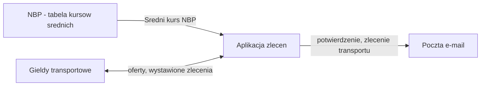
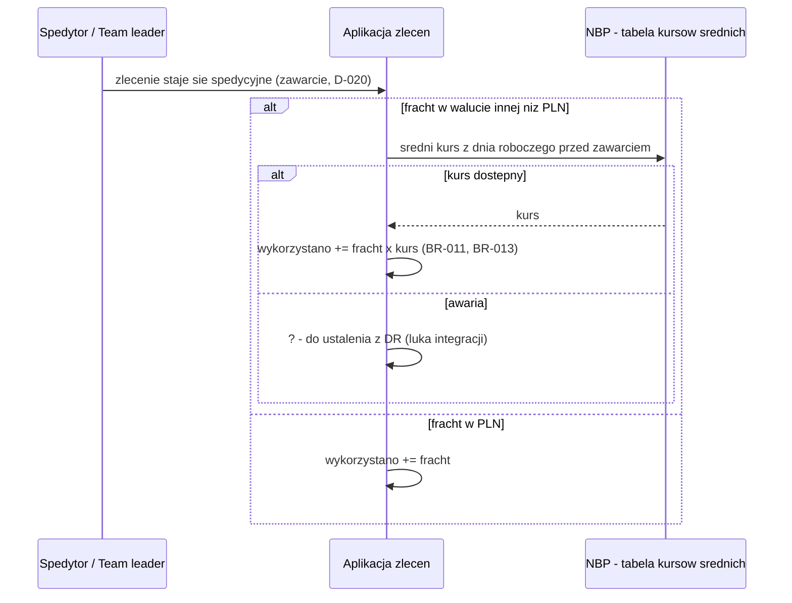

# Systemy

Rejestr systemow, z ktorymi aplikacja wymienia dane, i mapa systemow. Opisuje CO (dane, kierunek, co przy awarii),
nie JAK (protokoly, endpointy - to faza budowy).
Rola: nasz (budowana aplikacja, dokladnie jeden) | zewnetrzny | reczny (Excel, mail - jesli niesie dane spoza aplikacji)
Rodzaj modulu: monolit (brak `kind` w SDD.yaml) - kontrakty integracji jeszcze nie spisane jako R (walidacja 20: WARN).
Status: robocze | zakwestionowane (Q-xxx) | zatwierdzone

| ID | System | Rola | Wlasciciel | Master dla | Wymiana | Przy awarii | Krytyczna | Wymagania | Status | Zrodlo |
|----|--------|------|------------|------------|---------|-------------|-----------|-----------|--------|--------|
| S-001 | Aplikacja zlecen | nasz | wlasciciel procesu | Zlecenie, Limit kredytowy, Blokada, Konto spedytora | - | - | - | - | robocze | [Dok] prototyp-proces-dodawania-zlecenia.md §1-2; [Dok] wymagania-limity-i-blokady.md |
| S-002 | NBP - tabela kursow srednich | zewnetrzny | DR (Dzial Ryzyka) | Sredni kurs NBP | -> my, kurs z dnia roboczego przed zawarciem zlecenia | ? (luka integracji) | tak | - | robocze | [Biz] session-2026-09-26.md, Q-012, Q-024 (D-012, D-020) |
| S-003 | Gieldy transportowe (Gielda A, Gielda B) | zewnetrzny | ? (Q-038) | Oferta zewnetrzna | <-> wystawienie zlecenia i pobranie oferty, na zadanie | ? (luka integracji) | nie | - | robocze | [Dok] prototyp-proces-dodawania-zlecenia.md §2 pkt 5; [Biz] session-2026-09-26.md, Q-015 (D-014) |
| S-004 | Poczta e-mail | zewnetrzny | wlasciciel procesu | - | my ->, po utworzeniu zlecenia (zaplanowane, BR-030) | ? (luka integracji) | nie | - | robocze | [Dok] prototyp-proces-dodawania-zlecenia.md §3 |

## Mapa systemow
GENEROWANE z tabeli - nie edytuj (odtwarza /sdd:domain).

## Proces systemowy: kurs NBP przy zawarciu zlecenia
Zrodlo: [Biz] session-2026-09-26.md (D-012, D-020); galaz awarii - luka integracji, do pytania.

