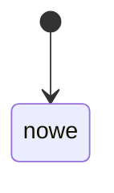

# Encje i stany

Dla kazdej encji: pola kluczowe, stany, przejscia (kto moze), diagram Mermaid.
`Zakwestionowane:` wypelniasz tylko wtedy, gdy zrodlo wyzsze w hierarchii podmylo
strukture encji - wpisz stany/przejscia i numer pytania. Puste = brak zastrzezen.

## <Encja>
Pola:
Stany:
Przejscia:
Zakwestionowane:

