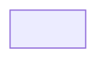
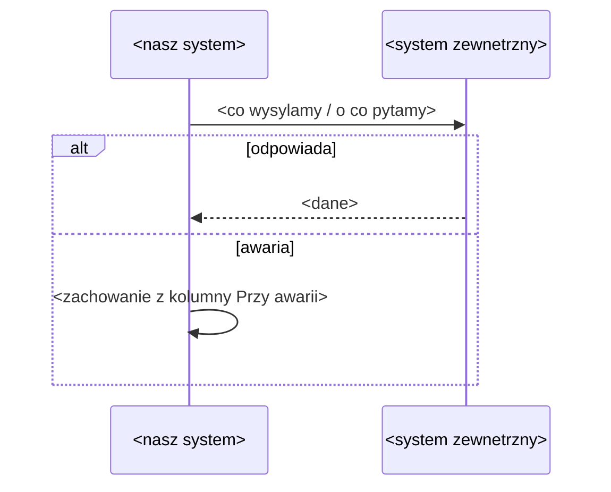

# Systemy

Rejestr systemow, z ktorymi aplikacja wymienia dane, i mapa systemow. Opisuje CO (dane, kierunek, co przy awarii),
nie JAK (protokoly, endpointy - to faza budowy).
Rola: nasz (budowana aplikacja, dokladnie jeden) | zewnetrzny | reczny (Excel, mail - jesli niesie dane spoza aplikacji)
      | konsument (tylko przy `kind: service` w SDD.yaml - kto korzysta z danych serwisu)
Status: robocze | zakwestionowane (Q-xxx) | zatwierdzone

- `Wlasciciel` - rola biznesowa odpowiedzialna za integracje (kogo pytac), nie osoba.
- `Master dla` - encje albo pola z ENTITIES/GLOSSARY, dla ktorych ten system jest zrodlem prawdy. Jeden master na dane.
- `Wymiana` - kierunek (`-> my`, `my ->`, `<->`) i czestotliwosc jezykiem biznesu (co 15 min, na zadanie, raz dziennie).
- `Przy awarii` - co widzi uzytkownik i co robi aplikacja, gdy system nie odpowiada. To wymaganie, nie detal.
- `Krytyczna` - `tak`, gdy bez integracji proces biznesowy staje; wtedy obowiazkowa sekcja "Proces systemowy".
- `Wymagania` - `R` rodzaju kontrakt (wejscie albo wyjscie) dla tej integracji; sciezka kaskady jak w RULES.
  Brak: walidacja kontrola 20 - WARN przy `monolith`, BLOCK przy `service`.
- Brak integracji: jeden wiersz `nasz` i zdanie "brak integracji" ze zrodlem `[Biz]`.

| ID | System | Rola | Wlasciciel | Master dla | Wymiana | Przy awarii | Krytyczna | Wymagania | Status | Zrodlo |
|----|--------|------|------------|------------|---------|-------------|-----------|-----------|--------|--------|
| S-001 | <nazwa> | nasz | <rola> | <encje> | - | - | - | - | robocze | <[Biz] plik> |

## Mapa systemow
GENEROWANE z tabeli - nie edytuj (odtwarza /sdd:domain).

<!-- Dla kazdej integracji z Krytyczna = tak:
## Proces systemowy: <nazwa>

-->
